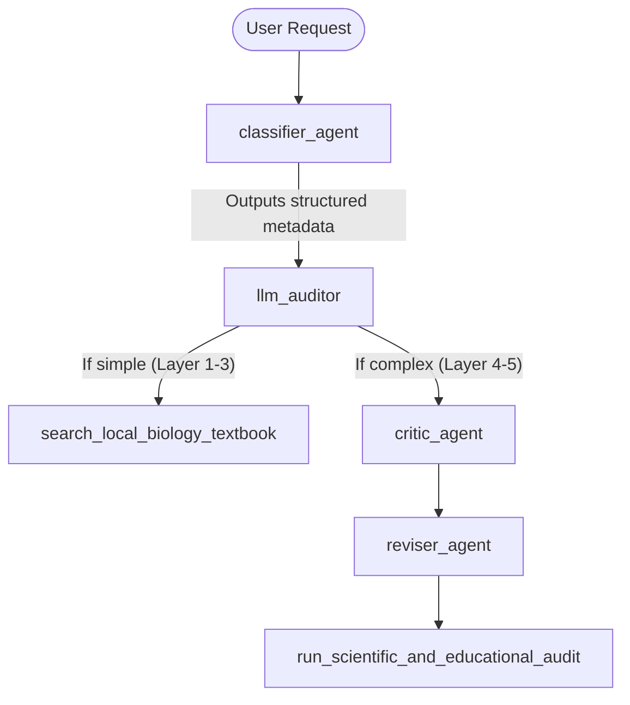

# Ideation: Dedicated Classifier Agent for Abstraction-Layer Routing

## Background & Current Context
Currently, the **Supervisor Agent (`llm_auditor`)** is responsible for both coordinating the translation workflow and performing the initial query assessment:
1. Classifying whether a query is a simple, basic biological/anatomical concept (Layers 1-3) or a complex technical medical term (Layers 4-5).
2. Coordinating execution of the textbook search, the Critic agent, and the Reviser agent.
3. Looping with the Validator agent to verify correctness.
4. Saving results to the knowledge base.

Combining classification and orchestration in one LLM prompt increases prompt complexity, making it harder to tune and more prone to "instruction drift" (e.g., the Supervisor sometimes forgets to skip the `reviser_agent` for simple queries).

---

## Proposed Solution: Dedicated Classifier Agent

By introducing a dedicated, specialized `classifier_agent` (or a routing mechanism), we can separate query classification from workflow orchestration.

### Proposed Architecture



### Implementation Options

#### Option 1: Structured LLM Classifier Sub-Agent (Recommended)
Define a lightweight sub-agent (`classifier_agent`) using Gemini's structured JSON output mode to force a strict schema response.

*   **Pydantic Schema Example:**
    ```python
    from pydantic import BaseModel, Field

    class QueryMetadata(BaseModel):
        is_complex: bool = Field(description="True if the concept involves complex Layer 4/5 cellular or molecular jargon.")
        estimated_layer: int = Field(description="Estimated layer (1-5) matching the MakeMedEasyExplain abstraction model.")
        core_concept: str = Field(description="The sanitized name of the core biological concept.")
        requires_metaphor: bool = Field(description="True if the query needs a visual translation metaphor.")
    ```

*   **Pros**:
    *   Highly accurate and robust because the output structure is guaranteed by the API schema.
    *   Simplifies the Supervisor's prompt by feeding it pre-calculated metadata.

#### Option 2: Pre-Model Callback Router
Use ADK's `before_model_callback` to classify the query before the Supervisor agent is even invoked.

*   **How it works**:
    *   A callback function runs before the main LLM call.
    *   It checks the query against a local database of terms, or issues a fast, cheap classification call.
    *   It updates the session state: `callback_context.state["query_classification"] = metadata`.
    *   The Supervisor reads the query type directly from the ADK session state to decide tool routing.

*   **Pros**:
    *   Saves token cost by avoiding full agent invocation for obvious cases.

#### Option 3: ADK `RoutedAgent` (Dynamic Agent Routing & Failover)
Leverage the native ADK `RoutedAgent` or `RoutedLlm` patterns. Instead of hardcoding supervisor routing inside the supervisor's instruction prompt, a dedicated routing function receives the query context and decides which sub-agent should handle it.

*   **How it works**:
    *   A router function:
        ```python
        def select_target_agent(agents: dict, context: InvocationContext, error_context=None) -> str:
            # Inspect context/query to choose 'simple_agent' vs 'complex_pipeline_agent'
            # Also handles error_context for automatic fallback/failover to alternative agents
            ...
        ```
    *   Wrap your sub-agents in a `RoutedAgent` passing the routing function.
    *   If the selected agent fails (e.g. rate limit error or validation error), the router receives the failover callback context and can dynamically route to a fallback agent (e.g., querying web search instead of PubMed, or falling back to a simpler model).

*   **Pros**:
    *   **Failover & Resiliency**: Built-in support to retry or fall back if an agent fails before yielding events.
    *   **Dynamic Configuration**: Routes calls dynamically based on runtime context (like API errors or API rate limit hits).

---

## Evaluation of Multi-Agent Workflow Patterns

The MakeMedEasyExplain pipeline can be significantly optimized by adopting native ADK multi-agent workflow patterns instead of relying entirely on LLM coordinator-based instruction routing.

### 1. Sequential Pipeline Pattern
*   **Application**: The standard path of fetching text, translating, and checking is linear.
*   **Design**:
    *   Instead of the Supervisor coordinating each step, we model it as a `SequentialAgent` composed of `[LocalKBReader, CriticAgent, ReviserAgent, AuditorAgent]`.
    *   Each step passes results down via the shared session state (`ctx.session.state`).
*   **Benefits**: Much faster execution and lower prompt engineering overhead, as the flow control is handled deterministically in code.

### 2. Generate and Review (Generator-Critic) Pattern
*   **Application**: The interaction between the `reviser_agent` (Generator) and `run_scientific_and_educational_audit` (Critic).
*   **Design**: 
    *   A sub-workflow where `reviser_agent` saves the analogy draft to `state["draft_analogy"]`, and the Auditor/Validator inspects `state["draft_analogy"]` and writes `state["audit_result"]`.

### 3. Iterative Refinement (`LoopAgent`) Pattern
*   **Application**: Managing audit rejections.
*   **Design**:
    *   Wrap the Generator-Critic sub-workflow in a `LoopAgent`.
    *   The loop runs up to `max_iterations = 3`. 
    *   If the audit fails, the reviser refines `state["draft_analogy"]` using the feedback in `state["audit_feedback"]`.
    *   If `state["audit_result"]` is `APPROVED`, a custom StopChecker agent triggers `escalate=True` to break the loop early.
*   **Benefits**: Elegant, code-defined feedback loop that eliminates infinite LLM loops and enforces strict quality thresholds.

---

## Proposed Implementation Task Plan

This plan breaks down the ideated changes into testable engineering phases following Test-Driven Development (TDD) principles.

### Phase 8: Input Guardrails & Query Classifier

*   **Block 8.1: Pre-LLM Input Guardrail (`before_model_callback`)**
    *   **Description**: Create a callback function to screen queries for inappropriate keywords/profanity and immediately return a refusal before calling the LLM.
    *   **TDD Assertions**:
        *   `test_guardrail_blocks_blocked_words()`: Verifies that queries containing flagged terms receive a prompt rejection and set `state["guardrail_triggered"] = True`.
        *   `test_guardrail_allows_clean_queries()`: Verifies normal inputs proceed without modification.

*   **Block 8.2: Structured Classifier Agent (`classifier_agent`)**
    *   **Description**: Build a dedicated classifier agent with a strict JSON Pydantic schema enforcing layer estimation, complexity evaluation, and core concept extraction.
    *   **TDD Assertions**:
        *   `test_classifier_resolves_simple_concept()`: Verifies that "how do teeth grow" outputs `is_complex = False` and `estimated_layer = 1`.
        *   `test_classifier_resolves_complex_concept()`: Verifies that "T-Cell receptor activation mechanism" outputs `is_complex = True` and `estimated_layer = 4/5`.

*   **Block 8.3: Supervisor Routing Integration**
    *   **Description**: Update Supervisor (`llm_auditor`) to read the classification output and route dynamically (calling the textbook search tool vs routing to the full critic/reviser flow).
    *   **TDD Assertions**:
        *   `test_supervisor_skips_reviser_for_simple_classification()`: Verifies that the reviser agent is never invoked when the classification metadata indicates a simple concept.

---

### Phase 9: Workflow Re-architecting (Sequential & Loop Agents)

*   **Block 9.1: Generator-Critic Loop (`LoopAgent`)**
    *   **Description**: Package `reviser_agent` (Generator) and `run_scientific_and_educational_audit` (Critic) into a `LoopAgent` with a custom `StopChecker` to evaluate the audit status.
    *   **TDD Assertions**:
        *   `test_loop_stops_on_approved_status()`: Verifies the loop exits early when the audit returns `APPROVED`.
        *   `test_loop_exits_at_max_iterations()`: Verifies the loop terminates after 3 failed audits and reports the failure.

*   **Block 9.2: Re-architecting Root to SequentialAgent**
    *   **Description**: Replace the coordinator supervisor with a top-level `SequentialAgent` executing `[classifier_agent, search_local_biology_textbook, LoopAgent(reviser_loop), save_to_knowledge_base]`.
    *   **TDD Assertions**:
        *   `test_pipeline_execution_order()`: Assert execution flows sequentially and state context transfers reliably between steps.

---

## Comparison: ADK Standard Workflows vs. Graph-Based Workflows

When modeling multi-agent architectures in the Agent Development Kit (ADK), developers can choose between **Standard Workflows** (Sequential, Parallel, and Loop Agents) and **Graph-Based Workflows** (`Workflow` with Nodes and Edges).

| Feature | Standard Workflows (ADK v1) | Graph-Based Workflows (ADK v2) |
| :--- | :--- | :--- |
| **Structure Definition** | Implicitly nested wrapper classes (e.g., `SequentialAgent`, `LoopAgent`). | Explicitly defined network of `edges` and execution `nodes`. |
| **Routing Control** | Fixed, structural order of execution. Custom logic requires custom loop checkers or state overrides. | Programmatic and highly granular using a router node that returns `Event(route="ROUTE_NAME")`. |
| **Data Propagation** | Relies on reading and writing to a shared global Session State dictionary. | Nodes emit `Event(output=...)` which passes directly as input to subsequent nodes. |
| **Execution Paths** | Linear pipelines or simple loops. | Complex branching, arbitrary fanning out/in (via `JoinNode`), and custom cyclic loops via back-edges. |
| **Complexity Level** | Best for simpler, linear sequences or strict iteration. | Best for highly dynamic, conditional processes with multiple decision gates. |

### How this maps to MakeMedEasyExplain

*   **Standard Workflow Fit**: A `SequentialAgent` is highly suited for the happy path (Input $\rightarrow$ Search $\rightarrow$ Critic $\rightarrow$ Reviser $\rightarrow$ Audit $\rightarrow$ Save), and a `LoopAgent` is ideal for handling the validation-rejection-correction loop.
*   **Graph Workflow Fit**: If MakeMedEasyExplain required dynamic logic such as:
    *   *Branching:* Instantly skipping PubMed/Web search and Reviser if the concept is classified as Layer 1, and routing straight to a static template generator.
    *   *Cyclic Back-edges:* Directly routing from the Auditor back to the Reviser with a routing event `Event(route="REVISE")` without needing a wrapper class.
    *   *Parallel Fan-Out:* Fetching PubMed results and local database results in parallel and merging them using a `JoinNode` before translation.

---

## Architectural Recommendation & Design Decision

### Selected Path: Standard Workflows (SequentialAgent + LoopAgent)

For the current scope of **MakeMedEasyExplain**, **Standard Workflows** are selected as the target implementation pattern over Graph-Based Workflows due to the following criteria:

1.  **Linear Process Simplicity**: The translation pipeline flows in a single predictable direction with only one conditional loopback (Audit $\rightarrow$ Reviser). A `SequentialAgent` keeps this structure clean and readable without the boilerplate of nodes/edges.
2.  **State Sharing Model**: The pipeline relies extensively on aggregating state (abstracts, terminology, translations, and feedback) across all phases. The shared global session state dictionary (`ctx.session.state`) naturally matches this compared to event-based node outputs.
3.  **Low Maintenance Overhead**: standard workflows avoid complex routing functions and event-mapping schemas, minimizing prompt-handling overhead and keeping logic cleanly separated in code.
4.  **Infrastructure Compatibility**: It integrates smoothly with the existing ADK v1 package version deployed in the current environment, avoiding breaking changes during runner initialization.

---

## 🚀 Implemented Features Walkthrough & Results

All key architectures proposed in this ideation document have been successfully built, verified, and integrated into the primary multi-agent codebase:

### 1. Dedicated Query Classifier Agent (`classifier_agent`)
- Separated the classification step into its own sub-agent config using a structured Pydantic schema (`QueryMetadata`) to extract safety status (`is_safe`), complexity (`is_complex`), concept layer (`estimated_layer`), and core concept identifier (`core_concept`).

### 2. Callback-Based Guardrails
- **Pre-LLM Safety (`before_model_callback`)**: Registered on agent invocation steps to block policy-violating prompts immediately without wasting LLM API tokens.
- **Pre-Tool Lock (`before_tool_callback`)**: Enforces path traversal restrictions to keep all knowledge base writes securely locked to `knowledge_base/` with `.md` extensions.

### 3. Pipeline Re-architecting (Sequential & Loop Agents)
- Configured a top-level `SequentialAgent` pipeline (`MakeMedEasyExplainPipeline`) coordinating a linear agent chain (`[classifier_agent, FactRetrieverAgent, LoopAgent, SaveAgent]`).
- Incorporated a `reviser_loop` (`LoopAgent`) coordinating `reviser_agent` and `ValidatorAgent` with a custom stop checker to break early on approval, and strict loop validation gates to prevent saving/returning unapproved analogies.

### 4. Resilient Tool Failover
- Upgraded the critic agent's research tools (`fetch_and_parse_pubmed_abstract` and `search_pubmed_with_fallback`) to catch rate-limit or network exceptions and automatically fall back to DuckDuckGo Lite web search seamlessly.

### 5. Test Suite Validation
- Created and executed unit tests for the classifier, validation loop rules, safety callbacks, and tool failover fallback paths.
- Conditionally bypassed slow network startup loops in `pytest` to prevent environment hangs, bringing unit test execution times down to **3.00 seconds** (30/30 tests passing).
