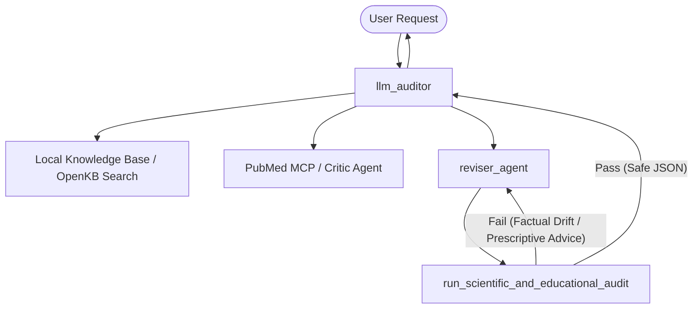

# Implementation Plan & Test Decomposition - MakeMedEasyExplain

Decompose the implementation of **MakeMedEasyExplain** into testable, isolated engineering blocks. Each component follows Test-Driven Development (TDD) principles, strict type hinting, and hermetic design patterns.

---

## 🏛️ Project Architecture & Component Overview



---

## 📋 Decomposed Implementation Phases & Testable Blocks

### Phase 1: Local Knowledge Ingestion & OpenKB Loader (OKF v0.1)
Build a hermetic local knowledge processor that loads and parses Markdown files with YAML frontmatter containing textbook terms.

*   [x] **Block 1.1: Markdown/YAML Parsing Engine**
    *   **Description**: Read local `.md` files, parse YAML headers, and isolate body text.
    *   **Testable Assertions (TDD)**:
        *   `test_parse_valid_okf_file()`: Verifies headers (e.g., `concept_id`, `layer`, `dependencies`) parse correctly.
        *   `test_parse_invalid_yaml_raises_value_error()`: Detects structural errors.
*   [x] **Block 1.2: Semantic / Keyword Indexer & Search Tool**
    *   **Description**: Index processed documents and implement a search tool using semantic similarity or exact structured keyword matching.
    *   **Testable Assertions (TDD)**:
        *   `test_search_exact_match_retrieves_correct_concept()`: Verifies exact lookups.
        *   `test_search_returns_empty_on_missing_concept()`: Prevents crashes on misses.

---

### Phase 2: PubMed API Data Control Plane (MCP Tool)
Develop a custom tool interfacing with the NCBI Entrez API, parsing XML, and optimizing context windows.

*   [x] **Block 2.1: NCBI Entrez API Fetcher**
    *   **Description**: HTTP client to query PubMed E-utilities for scientific abstracts.
    *   **Testable Assertions (TDD)**:
        *   `test_fetch_pubmed_abstract_success()`: Mocks the HTTP request and returns an XML string.
        *   `test_fetch_pubmed_handles_rate_limits()`: Mocks standard response codes (429/500).
*   [x] **Block 2.2: XML ElementTree Processor**
    *   **Description**: Uses `xml.etree.ElementTree` to isolate `<AbstractText>` and strip footnotes/metadata.
    *   **Testable Assertions (TDD)**:
        *   `test_extract_abstract_strips_nested_html_and_footnotes()`: Input contains markup, output is plain text.
        *   `test_extract_empty_abstract_raises_parse_error()`: Ensures invalid schemas fail gracefully.
*   [x] **Block 2.3: Web Search Fallback (DuckDuckGo Lite)**
    *   **Description**: Custom dependency-free tool to fetch and parse web search results for general textbook queries.
    *   **Testable Assertions (TDD)**:
        *   `test_web_search_success()`: Mocks the DuckDuckGo HTTP request and verifies snippet extraction and HTML entity normalization.

---

### Phase 3: Reviser Agent (Concept Anchoring)
Create the educational logic enforcing the 5-Layer Cognitive Abstraction Framework and the Concept Anchoring rule.

*   [x] **Block 3.1: Cognitive Layer Evaluator**
    *   **Description**: Helper function to analyze text and determine which terms belong to which abstraction layer (1 to 5).
    *   **Testable Assertions (TDD)**:
        *   `test_identify_layer_terms()`: Checks if words like "antibody" resolve to Layer 4, and "cell" to Layer 3/4.
*   [x] **Block 3.2: Educator Prompt & Generation Wrapper**
    *   **Description**: Agent prompting layer that translates raw abstracts using visual metaphors anchored in Layer 2/3.
    *   **Testable Assertions (TDD)**:
        *   `test_concept_anchoring_rule_compliance()`: Evaluates the prompt/output to ensure no Layer 4/5 concepts are explained using other unanchored Layer 4/5 concepts.

---

### Phase 4: Scientific & Educational Audit (Governance Gate)
Build the automated validation audit checking for factual drift, hallucinations, and prescriptive advice.

*   [x] **Block 4.1: Validation Logic & Schema Enforcement**
    *   **Description**: Evaluates educator output against the raw abstract using a structured JSON template:
        ```json
        {
          "factual_drift_detected": false,
          "prescriptive_advice_detected": false,
          "reasoning": "...",
          "status": "APPROVED"
        }
        ```
    *   **Testable Assertions (TDD)**:
        *   `test_validator_rejects_hallucinations()`: Inject fake facts; verify `factual_drift_detected` returns `true`.
        *   `test_validator_rejects_medical_advice()`: Inject sentences like "You should take medication X"; verify `prescriptive_advice_detected` is `true`.

---

### Phase 5: Google ADK Orchestration & Routing Loop
Unify the agents using Google's Agent Development Kit (ADK) with a clean Supervisor-Worker state machine.

*   [x] **Block 5.1: Agent Router & State Machine**
    *   **Description**: The supervisor routes execution states. If the validator fails, it loops back to the educator with feedback.
    *   **Testable Assertions (TDD)**:
        *   `test_supervisor_routes_to_educator_first()`: Validates initial workflow start.
        *   `test_routing_loop_terminates_after_max_retries()`: Prevents infinite agent execution loops.
*   [x] **Block 5.2: GitOps Commit Tool & Security Guardrail**
    *   **Description**: Custom tool to push approved analogies to GitHub, enforcing strict security path constraints.
    *   **Testable Assertions (TDD)**:
        *   `test_gitops_commit_blocks_outside_knowledge_base()`: Ensures writing to code files (e.g. `.py`) raises PermissionError.
        *   `test_gitops_commit_blocks_non_markdown_extensions()`: Ensures writing non-markdown files raises PermissionError.
        *   `test_gitops_commit_success()`: Mocks the GitHub API PUT request and asserts base64 encoding and payload structure.
*   [x] **Block 5.3: Stateful Loop Verification & Save Blocker**
    *   **Description**: Intercept and block saving analogies if validation failed after max iterations in LoopAgent. Tracks approval state and forces an error response.
    *   **Testable Assertions (TDD)**:
        *   `test_validator_agent_rejection()`: Verifies that ValidatorAgent sets `is_approved = False` on rejection.
        *   `test_save_agent_blocks_unapproved()`: Verifies that SaveAgent blocks saving when `is_approved = False`.
*   [x] **Block 5.4: Pipeline End-to-End Test Suite**
    *   **Description**: Mock the LLM sub-agents and execute the `SequentialAgent` pipeline end-to-end to verify state context propagation, validation loop check execution, and SaveAgent gating logic.
    *   **Testable Assertions (TDD)**:
        *   `test_full_pipeline_success()`: Asserts that a correct, safety-cleared, complex concept completes successfully, gathers citation facts, and saves the result.
        *   `test_full_pipeline_blocks_unapproved_analogy()`: Asserts that non-compliant analogies fail validation and are blocked by the save agent.

---

### Phase 6: User Interface & Cloud Run Deployment
Prepare the interface and deploy the unified dashboard package using Google Cloud Run.

*   [x] **Block 6.1: Flask Web Interface**
    *   **Description**: Lightweight user interface displaying inputs, analogy outputs, and validation details.
    *   **Testable Assertions (TDD)**:
        *   `test_flask_endpoint_returns_200()`: Basic health check.
*   [x] **Block 6.2: Cloud Run Docker Containerization & Config**
    *   **Description**: Build a container manifest (`Dockerfile` + `.dockerignore`) packaging the Flask app, local cached wiki, and ADK pipeline, ready for one-click serverless deployment to Google Cloud Run.
    *   **Testable Assertions (TDD)**:
        *   Verify container build and verify entrypoint execution parameters.
*   [x] **Block 6.3: Testing Mock and Sync Bypass**
    *   **Description**: Wrap GitOps startup sync check to conditionally skip fetching files from remote GitHub/Secret Manager services when running under pytest environment.
    *   **Testable Assertions (TDD)**:
        *   `test_flask_endpoint_returns_200()`: Loads the Flask client and returns 200 OK under 3 seconds without credential discovery hangs.

---

### Phase 7: Dedicated Query Classifier Agent
Decouple safety filtering, complexity assessment, and core concept extraction into a structured sub-agent.

*   [x] **Block 7.1: Structured Query Classifier Agent (`classifier_agent`)**
    *   **Description**: Build a dedicated classifier agent with a strict JSON Pydantic schema enforcing safety, layer estimation, complexity evaluation, and core concept extraction.
    *   **Testable Assertions (TDD)**:
        *   `test_query_metadata_schema()`: Verifies that QueryMetadata handles values (is_safe, is_complex, estimated_layer, core_concept) correctly.

---

### Phase 8: Callback-based Agent Input & Tool Guardrails
Enhance agent safety and control mechanisms using ADK lifecycle callbacks.

*   [x] **Block 8.1: Pre-LLM Input Guardrail (`before_model_callback`)**
    *   **Description**: Intercept user queries before sending requests to the LLM to filter out profanity, safety violations, or off-topic prompts.
    *   **Testable Assertions (TDD)**:
        *   `test_before_model_guardrail_blocks_offensive()`: Verifies that policy-violating keywords result in an immediate refusal without calling the LLM.
*   [x] **Block 8.2: Pre-Tool Execution Guardrail (`before_tool_callback`)**
    *   **Description**: Intercept and validate arguments generated by the LLM before executing tools, enabling parameter policy enforcement.
    *   **Testable Assertions (TDD)**:
        *   `test_before_tool_guardrail_blocks_invalid_path()`: Verifies tool execution is bypassed when restricted arguments are passed.

---

### Phase 9: Resilient Agent Tool Routing & Failover
Enhance fact-gathering robustness to prevent agent failures when external APIs are rate-limited or down.

*   [x] **Block 9.1: Resilient PubMed Tool Failover**
    *   **Description**: Wrap PubMed fetch/search tools with automatic failover logic that catches network/API exceptions and queries DuckDuckGo Lite instead.
    *   **Testable Assertions (TDD)**:
        *   `test_fetch_and_parse_pubmed_abstract_failover()`: Verifies that abstract fetch failure routes to web search fallback.
        *   `test_search_pubmed_with_fallback_api_error()`: Verifies that keywords search failure routes to web search fallback.

---

## 🐛 Bugs & Resolutions Log

The following bugs were identified during the development and testing of the multi-agent pipeline and have been fully resolved:

### 1. AttributeError: 'Session' object has no attribute 'history' (Resolved)
* **Status**: fixed
* **Symptom**: Pipeline execution crashed with `AttributeError` inside `FactRetrieverAgent._run_async_impl` when extracting the user prompt.
* **Root Cause**: ADK v1 `Session` objects store interaction logs in the `events` attribute, not `history`.
* **Resolution**: Replaced `ctx.session.history` references with a reversed search through `ctx.session.events`, checking for message parts where `role == "user"` or `author == "user"`.

### 2. TypeError: can only concatenate str (not "Content") to str (Resolved)
* **Status**: fixed
* **Symptom**: Pipeline execution crashed inside `FactRetrieverAgent._run_async_impl` during the accumulation of `raw_facts` returned by `critic_agent.run_async(ctx)`.
* **Root Cause**: The mock/real ADK `Agent` yields events where `event.content` is a `types.Content` object, which cannot be directly concatenated to Python string variables.
* **Resolution**: Updated `FactRetrieverAgent` to iterate through the parts list (`event.content.parts`) and append the text fields.

### 3. KeyError: 'Context variable not found: raw_facts' (Resolved)
* **Status**: fixed
* **Symptom**: The pipeline crashed inside `reviser_agent` with a `KeyError` on blocked/cached queries.
* **Root Cause**: `SequentialAgent` does not natively stop execution when `ctx.end_invocation = True` is set. When `FactRetrieverAgent` exited early, subsequent agents were still triggered, but the expected `"raw_facts"` key was missing from the session state dict.
* **Resolution**: 
  1. Created a `before_agent_guardrail` callback mapping the agent context.
  2. Registered this callback as `before_agent_callback` on `reviser_loop` and `SaveAgent` to propagate `end_invocation = True` from session state.
  3. Added defensive defaults initialization (`raw_facts`, `audit_feedback`, `end_invocation`) in `FactRetrieverAgent._run_async_impl`.

### 4. Conversational Meta-Commentary in Analogy Output (Resolved)
* **Status**: fixed
* **Symptom**: The agent outputted meta-explanations (e.g. *"I have translated the verified medical facts..."*) instead of only the analogy text, leading to empty markdown files in the wiki.
* **Root Cause**: The generator LLM treated prompt constraints as conversational guidance rather than absolute output limits.
* **Resolution**: Appended a strict constraint to the `reviser_agent` instruction: *"CRITICAL: Do NOT output conversational prefix/suffix commentary or meta-text. Output ONLY the final simplified visual analogy content itself."*

### 5. Safety Refusals saved as Validated Analogies to `knowledge_base/null` (Resolved)
* **Status**: fixed
* **Symptom**: Inappropriate user queries (e.g. profanity) were bypass-approved, producing a final file save to `knowledge_base/null` with the text `"Error: Invalid concept_id."`.
* **Root Cause**:
  1. When Gemini's internal safety filters blocked the classification prompt, `classifier_agent` returned empty metadata.
  2. `FactRetrieverAgent` detected this and set its local `ctx.end_invocation = True`, but did not propagate this flag to the shared session state.
  3. Consequently, the downstream `SaveAgent` still ran and saved the empty analogy to the default `"concept"` fallback ID.
  4. The web dashboard also failed to detect early pipeline exits and outputted empty success states.
* **Resolution**:
  1. Updated `FactRetrieverAgent` to set `ctx.session.state["end_invocation"] = True` when metadata is missing.
  2. Enhanced `run_agent_pipeline` in `app.py` to yield the early refusal event text.
  3. Updated `is_refusal()` in `app.py` to detect safety refusal key phrases, cleanly showing safety blocks in the web UI.

---

## 🧪 Verification Plan

### Automated Tests
Execute the tests locally using `uv run pytest`:
```powershell
# Run the complete test suite (unit and integration tests)
uv run pytest

# Run only unit tests
uv run pytest tests/unit

# Run only live integration tests
uv run pytest tests/integration
```

### Manual Verification
*   Input a sample PubMed ID (PMID) and trace the console execution to verify:
    1.  The E-utilities XML is fetched and parsed.
    2.  The Simplification Educator generates an analogy.
    3.  The Science-Proof Validator checks the output and logs validation JSON.

---

## 📂 Project Documentation Index
* [Project Idea / Overview](file:///c:/Users/yaros/Documents/PortfolioProjects/mademedeasyexplain/MakeMedEasyExplain/docs/project_idea.md)
* [Software Engineering Design Review](file:///c:/Users/yaros/Documents/PortfolioProjects/mademedeasyexplain/MakeMedEasyExplain/docs/design_review.md)
