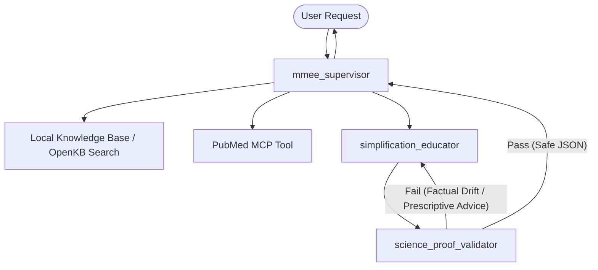

# Implementation Plan & Test Decomposition - MakeMedEasyExplain

Decompose the implementation of **MakeMedEasyExplain** into testable, isolated engineering blocks. Each component follows Test-Driven Development (TDD) principles, strict type hinting, and hermetic design patterns.

---

## 🏛️ Project Architecture & Component Overview



---

## 📋 Decomposed Implementation Phases & Testable Blocks

### Phase 1: Local Knowledge Ingestion & OpenKB Loader (OKF v0.1)
Build a hermetic local knowledge processor that loads and parses Markdown files with YAML frontmatter containing textbook terms.

*   **Block 1.1: Markdown/YAML Parsing Engine**
    *   **Description**: Read local `.md` files, parse YAML headers, and isolate body text.
    *   **Testable Assertions (TDD)**:
        *   `test_parse_valid_okf_file()`: Verifies headers (e.g., `concept_id`, `layer`, `dependencies`) parse correctly.
        *   `test_parse_invalid_yaml_raises_value_error()`: Detects structural errors.
*   **Block 1.2: Semantic / Keyword Indexer & Search Tool**
    *   **Description**: Index processed documents and implement a search tool using semantic similarity or exact structured keyword matching.
    *   **Testable Assertions (TDD)**:
        *   `test_search_exact_match_retrieves_correct_concept()`: Verifies exact lookups.
        *   `test_search_returns_empty_on_missing_concept()`: Prevents crashes on misses.

---

### Phase 2: PubMed API Data Control Plane (MCP Tool)
Develop a custom tool interfacing with the NCBI Entrez API, parsing XML, and optimizing context windows.

*   **Block 2.1: NCBI Entrez API Fetcher**
    *   **Description**: HTTP client to query PubMed E-utilities for scientific abstracts.
    *   **Testable Assertions (TDD)**:
        *   `test_fetch_pubmed_abstract_success()`: Mocks the HTTP request and returns an XML string.
        *   `test_fetch_pubmed_handles_rate_limits()`: Mocks standard response codes (429/500).
*   **Block 2.2: XML ElementTree Processor**
    *   **Description**: Uses `xml.etree.ElementTree` to isolate `<AbstractText>` and strip footnotes/metadata.
    *   **Testable Assertions (TDD)**:
        *   `test_extract_abstract_strips_nested_html_and_footnotes()`: Input contains markup, output is plain text.
        *   `test_extract_empty_abstract_raises_parse_error()`: Ensures invalid schemas fail gracefully.

---

### Phase 3: Simplification Educator Agent (Concept Anchoring)
Create the educational logic enforcing the 5-Layer Cognitive Abstraction Framework and the Concept Anchoring rule.

*   **Block 3.1: Cognitive Layer Evaluator**
    *   **Description**: Helper function to analyze text and determine which terms belong to which abstraction layer (1 to 5).
    *   **Testable Assertions (TDD)**:
        *   `test_identify_layer_terms()`: Checks if words like "antibody" resolve to Layer 4, and "cell" to Layer 3/4.
*   **Block 3.2: Educator Prompt & Generation Wrapper**
    *   **Description**: Agent prompting layer that translates raw abstracts using visual metaphors anchored in Layer 2/3.
    *   **Testable Assertions (TDD)**:
        *   `test_concept_anchoring_rule_compliance()`: Evaluates the prompt/output to ensure no Layer 4/5 concepts are explained using other unanchored Layer 4/5 concepts.

---

### Phase 4: Science-Proof Validator Agent (Governance Gate)
Build the automated validator agent checking for factual drift, hallucinations, and prescriptive advice.

*   **Block 4.1: Validation Logic & Schema Enforcement**
    *   **Description**: Evaluates educator output against the raw abstract using a structured JSON template:
        ```json
        {
          "factual_drift_detected": false,
          "prescriptive_advice_detected": false,
          "reasoning": "...",
          "status": "APPROVED"
        }
        ```
    *   **Testable Assertions (TDD)**:
        *   `test_validator_rejects_hallucinations()`: Inject fake facts; verify `factual_drift_detected` returns `true`.
        *   `test_validator_rejects_medical_advice()`: Inject sentences like "You should take medication X"; verify `prescriptive_advice_detected` is `true`.

---

### Phase 5: Google ADK Orchestration & Routing Loop
Unify the agents using Google's Agent Development Kit (ADK) with a clean Supervisor-Worker state machine.

*   **Block 5.1: Agent Router & State Machine**
    *   **Description**: The supervisor routes execution states. If the validator fails, it loops back to the educator with feedback.
    *   **Testable Assertions (TDD)**:
        *   `test_supervisor_routes_to_educator_first()`: Validates initial workflow start.
        *   `test_routing_loop_terminates_after_max_retries()`: Prevents infinite agent execution loops.

---

### Phase 6: User Interface & Deployment Preparation
Prepare the interface and deploy using Google Vertex AI Reasoning Engine (Tier 0).

*   **Block 6.1: Flask Web Interface**
    *   **Description**: Lightweight user interface displaying inputs, analogy outputs, and validation details.
    *   **Testable Assertions (TDD)**:
        *   `test_flask_endpoint_returns_200()`: Basic health check.
*   **Block 6.2: Vertex AI Agent Engine App Configuration**
    *   **Description**: Build configuration files to register tools and agents under Vertex AI `InMemoryArtifactService`.

---

## 🧪 Verification Plan

### Automated Tests
Execute the tests locally using `pytest`:
```powershell
# Run all unit tests
pytest tests/unit

# Run specific component tests (e.g. OpenKB loader)
pytest tests/unit/test_openkb_loader.py
```

### Manual Verification
*   Input a sample PubMed ID (PMID) and trace the console execution to verify:
    1.  The E-utilities XML is fetched and parsed.
    2.  The Simplification Educator generates an analogy.
    3.  The Science-Proof Validator checks the output and logs validation JSON.
